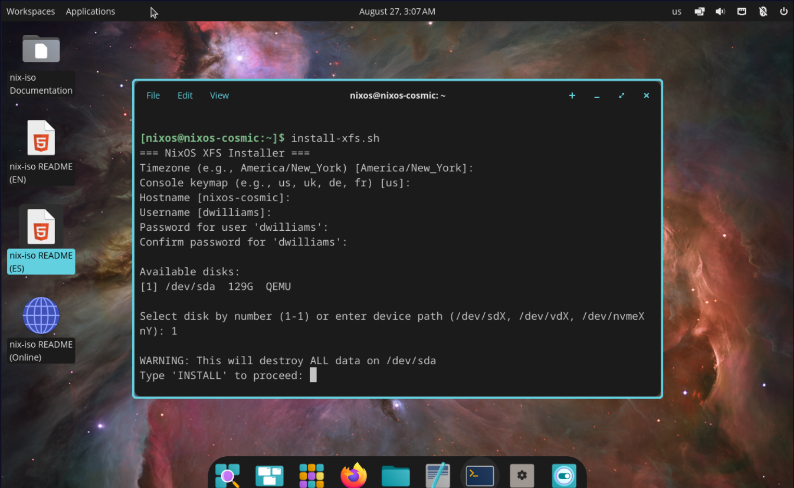

[English](./README.md) | Español

# ddubsos ISOs de instalación/recuperación de NixOS

---

<div align="center">
  
  <br />
  <em>Captura: instalación de NixOS usando XFS en la interfaz gráfica COSMIC Desktop</em>
</div>


### ISOs personalizadas de instalación y recuperación de NixOS basadas en nixos-unstable, con enfoque en soporte moderno de sistemas de archivos (Btrfs, ZFS, XFS, ext4, bcachefs) y un conjunto sólido de herramientas de recuperación.

Créditos

- Este repositorio es un derivado e intensamente inspirado en el trabajo de
  JohnRTitor/nix-iso.
  - Proyecto upstream: https://github.com/JohnRTitor/nix-iso
- Mantenemos un fork con nuestros propios perfiles, herramientas y documentación
  adaptados para rescate e instalaciones repetibles.

Qué proporciona este proyecto

- Múltiples perfiles de ISO, todos incluyendo por defecto el conjunto de herramientas de recuperación:
  - Minimal (nixos-minimal)
  - GNOME (nixos-gnome)
  - COSMIC (nixos-cosmic, experimental)
  - Recovery (nixos-recovery)
- Scripts de instalación para NixOS unstable con soporte para:
  - ZFS
  - Btrfs
  - XFS
  - EXT4
  - bcachefs
- La documentación de los scripts de instalación del SO está más abajo
- Hay enlaces dedicados para cada uno de los scripts a continuación

Nota sobre las GUIs del ISO en vivo: Los perfiles GNOME y COSMIC solo cambian la interfaz de usuario del ISO en vivo. Los instaladores NO instalan GNOME ni COSMIC en el sistema de destino; instalan un NixOS base. Puedes añadir un entorno de escritorio después de la instalación inicial.

- Selección de kernel moderno y paquetes ZFS mediante chaotic nyx para un soporte más amplio de hardware/sistemas de archivos.
- Conjunto completo de herramientas de sistemas de archivos para instalaciones y rescate:
  - Btrfs: btrfs-progs (subvolúmenes @, @home, @nix, @snapshots)
  - ext4: e2fsprogs
  - XFS: xfsprogs
  - bcachefs: bcachefs-tools (mkfs con soporte de compresión zstd)
  - ZFS: userland (zpool, zfs) tomado de config.boot.zfs.package para compatibilidad con el kernel
  - NFS/SMB: nfs-utils, cifs-utils
  - Además: ntfs3g, exfatprogs, dosfstools
- Recuperación/imagen y diagnóstico: ddrescue, testdisk, smartmontools, nvme-cli,
  hdparm, pciutils/usbutils y más.
- Todos los perfiles incluyen el directorio scripts/ en $PATH en el ISO en vivo por
  conveniencia.

Advertencia sobre operaciones destructivas

- Los scripts de instalación volverán a particionar y formatear el disco seleccionado. Esto
  destruye todos los datos de ese disco.
- Lee todas las indicaciones con atención. Los scripts requieren escribir INSTALL para continuar como
  verificación de seguridad.

Cómo construir las ISOs

- Prerrequisitos: habilita flakes y acepta la configuración de la flake (ver abajo la configuración de caché).
- Clonar:
  - git clone https://github.com/dwilliam62/nix-iso.git
  - cd nix-iso
  - Se sugiere ejecutar `nix flake update`

Preferido (script auxiliar)

- Usa el helper para evitar rutas de atributos largas. También establece por defecto
  NIXPKGS_ALLOW_BROKEN=1 para coincidir con el comportamiento histórico.
  ```
  # ISO mínima
  ./scripts/build-iso.sh minimal

  # ISO GNOME
  ./scripts/build-iso.sh gnome

  # ISO COSMIC (experimental)
  ./scripts/build-iso.sh cosmic

  # ISO de recuperación
  ./scripts/build-iso.sh nixos-recovery
  ```
- El script acepta alias amigables y errores comunes de tipeo (ver cabecera de scripts/build-iso.sh para detalles).
- Resultado: la imagen ISO estará en ./result/iso/

Avanzado/construcción manual

- Si prefieres comandos nix directos:
  ```
  # Mínima
  env NIXPKGS_ALLOW_BROKEN=1 nix build .#nixosConfigurations.nixos-minimal.config.system.build.isoImage --impure
  # GNOME
  env NIXPKGS_ALLOW_BROKEN=1 nix build .#nixosConfigurations.nixos-gnome.config.system.build.isoImage --impure
  # COSMIC
  env NIXPKGS_ALLOW_BROKEN=1 nix build .#nixosConfigurations.nixos-cosmic.config.system.build.isoImage --impure
  # Recuperación
  env NIXPKGS_ALLOW_BROKEN=1 nix build .#nixosConfigurations.nixos-recovery.config.system.build.isoImage --impure
  ```

Cachés binarias (muy recomendado)

- Para evitar compilar el kernel y ZFS desde código fuente, configura cachés en el
  host de compilación:

NixOS (recomendado) nix.settings = { experimental-features = [ "nix-command"
"flakes" ]; accept-flake-config = true; substituters = [
"https://cache.nixos.org" "https://nix-community.cachix.org"
"https://nyx.chaotic.cx/" ]; trusted-public-keys = [
"nix-community.cachix.org-1:mB9FSh9qf2dCimDSUo8Zy7bkq5CX+/rkCWyvRCYg3Fs="
"nyx.chaotic.cx-1:HfnXSw4pj95iI/n17rIDy40agHj12WfF+Gqk6SonIT8=" ]; };

No NixOS (demonio multiusuario) accept-flake-config = true substituters =
https://cache.nixos.org https://nix-community.cachix.org https://nyx.chaotic.cx/
trusted-public-keys =
nix-community.cachix.org-1:mB9FSh9qf2dCimDSUo8Zy7bkq5CX+/rkCWyvRCYg3Fs=
nyx.chaotic.cx-1:HfnXSw4pj95iI/n17rIDy40agHj12WfF+Gqk6SonIT8=

Uso de los scripts de instalación (en el ISO en vivo o cualquier entorno en vivo de NixOS)

- Scripts disponibles en `~/nix-iso/scripts`:
  - install-btrfs.sh — Btrfs con subvolúmenes @, @home, @nix, @snapshots; compresión
    zstd
  - install-ext4.sh — instalador para ext4 (habilita fstrim en la configuración)
  - install-xfs.sh — instalador para XFS (habilita fstrim en la configuración)
  - install-zfs.sh — ZFS con valores razonables por defecto; puntos de montaje legacy; genera
    networking.hostId
  -
  > Los siguientes scripts deben considerarse EXPERIMENTALES. Actualmente están en
  > desarrollo (ago 2025). Ninguno debe usarse con fines de producción de
  > ningún tipo. ¡Has sido advertido!
  -
  - install-bcachefs.sh — bcachefs con --compression=zstd
  - install-zfs-boot-mirror.sh — Espejado ZFS en la unidad de arranque
  - install-btrfs-boot-mirror.sh — Espejado Btrfs en la unidad de arranque

- Ejecuta como root; los scripts se autoelevan vía sudo cuando es posible:
  ```
  sudo ./scripts/install-btrfs.sh
  # o install-ext4.sh, install-xfs.sh, install-bcachefs.sh, install-zfs.sh
  ```

Instaladores con espejo (experimentales; úsalo bajo tu propio riesgo)

- Scripts: scripts/install-zfs-boot-mirror.sh y
  scripts/install-btrfs-boot-mirror.sh
- Propósito: configurar una raíz en espejo (ZFS/Btrfs) y dos particiones del sistema EFI
  (/boot y /boot2). En nixpkgs más recientes, systemd-boot puede replicar automáticamente
  el gestor de arranque a /boot2.
- Compatibilidad:
  - La autorreplicación depende de la opción de nixpkgs
    boot.loader.systemd-boot.mirroredBoots. Los instaladores detectan su presencia
    y la habilitan cuando está disponible.
  - En snapshots antiguos de nixpkgs que no proporcionan esta opción, la instalación
    sigue funcionando; solo se omite la sincronización automática de /boot -> /boot2. Los
    espejos de almacenamiento ZFS/Btrfs no se ven afectados.
  - Para asegurar las funciones actuales en el ISO en vivo, actualiza el flake.lock de este repositorio
    (nix flake update) y reconstruye el ISO.

> Advertencia: estos instaladores con espejo son experimentales y no están pensados para uso de
> producción. Úsalos bajo tu propio riesgo. Prueba exhaustivamente, mantén copias de seguridad y
> asegúrate de tener una ruta de arranque alternativa (p. ej., entrada de firmware para la segunda
> ESP).

Notas sobre valores predeterminados

- Particionado: GPT con una partición del sistema EFI (FAT32) de 1 GiB + el resto para el
  sistema de archivos elegido.
- Gestor de arranque: systemd-boot en UEFI.
- zswap: habilitado vía kernelParams (zstd, z3fold) para amplia compatibilidad.
- Usuarios: los scripts piden un usuario y cifran la contraseña con openssl -6 si
  está disponible.
- Configuración generada: incluye un conjunto razonable de herramientas y habilita
  NetworkManager y SSH.

Resumen de herramientas incluidas

- Consulta Tools-Included.es.md para la lista completa y actualizada de herramientas incluidas en
  el ISO en vivo.
- La documentación está disponible en el ISO en vivo bajo /etc/nix-iso-docs (README.md,
  HOWTO.md, Tools-Included.md, docs/*).

Documentación

- Descripción general de sistemas de archivos:
  [docs/filesystems-overview.es.md](docs/filesystems-overview.es.md)
- Valores predeterminados y parámetros:
  [docs/filesystem-defaults.es.md](docs/filesystem-defaults.es.md)
- Dependencias de paquetes:
  [docs/package-dependencies.es.md](docs/package-dependencies.es.md)
- Guías rápidas (Quickstarts):
  - ZFS (disco único): [docs/quickstart-zfs.es.md](docs/quickstart-zfs.es.md)
  - ZFS (en espejo):
    [docs/quickstart-zfs-mirror.es.md](docs/quickstart-zfs-mirror.es.md)
  - Btrfs (disco único): [docs/quickstart-btrfs.es.md](docs/quickstart-btrfs.es.md)
  - Btrfs (en espejo):
    [docs/quickstart-btrfs-mirror.es.md](docs/quickstart-btrfs-mirror.es.md)
  - bcachefs (experimental):
    [docs/quickstart-bcachefs.es.md](docs/quickstart-bcachefs.es.md)
- Playbook no interactivo para Btrfs:
  [docs/nixos-btrfs-install.es.md](docs/nixos-btrfs-install.es.md)

Licencia y contribuciones

- Licenciado bajo Apache-2.0 (ver LICENSE). Traducción: [LICENSE.es.md](./LICENSE.es.md) (referencia; la versión en inglés es la oficial). El software de terceros permanece bajo
  sus respectivas licencias.
- Las contribuciones son bienvenidas vía issues y PRs.

Descargo de responsabilidad

- Aunque nos esforzamos por proporcionar valores seguros por defecto, úsalo bajo tu propio riesgo. Haz siempre
  copia de seguridad de los datos importantes antes de ejecutar operaciones destructivas.

